# System Flow — Oxford Flowers 102 Transfer Learning Pipeline

```mermaid
flowchart TD

    %% ── STEP 1: DATA LOADING ──────────────────────────────────
    A([START]) --> B[Load Oxford Flowers 102\nvia TensorFlow Datasets]

    B --> C{Which version?}

    %% ── STEP 2: SPLIT STRATEGY ────────────────────────────────
    C -- "v1 / v4\nStandard split" --> D1[Train = ds_train\n1,020 images\n10 per class]
    C -- "v3 / v3-02 / v5\nInverted split" --> D2[Train = ds_test\n6,149 images\n20-238 per class]

    D1 --> E[Val = ds_val\n1,020 images\nused for monitoring only]
    D2 --> E

    %% ── STEP 3: PREPROCESSING ─────────────────────────────────
    E --> F[Preprocessing Pipeline\nResize to 224×224\nCast to float32\nBackbone normalization]

    F --> G{Split type?}
    G -- Training set --> H[Apply Augmentation\nFlip / Rotation / Zoom\n± Contrast / Translation]
    G -- Val / Eval set --> I[No augmentation]

    H --> J[Batch size 64\nPrefetch AUTOTUNE]
    I --> J

    %% ── STEP 4: MODEL CONSTRUCTION ────────────────────────────
    J --> K{Run for both backbones}

    K --> L1[MobileNetV2\nImageNet weights\n~2.3M params]
    K --> L2[ResNet50V2\nImageNet weights\n~23.5M params]

    L1 --> M[Attach Classifier Head\nGAP → BN → Dense → Dropout\n→ Dense → Dropout → Softmax 102]
    L2 --> M

    %% ── STEP 5: PHASE 1 ───────────────────────────────────────
    M --> N[PHASE 1 — Feature Extraction\nBackbone fully frozen\nTrain head only\nAdam LR = 1e-3\nMax 20-30 epochs]

    N --> O[Monitor val_loss\nEarlyStopping patience=5\nSave best checkpoint]

    O --> P{Phase 1 done?}
    P -- "val_loss still improving" --> N
    P -- "Converged / early stopped" --> Q

    %% ── STEP 6: PHASE 2 SETUP ─────────────────────────────────
    Q[Unfreeze top 40 layers\nMobileNetV2\nor top 50 layers\nResNet50V2]

    Q --> R[Re-freeze ALL BatchNorm layers\ninside backbone\n← Critical fix missing in v1]

    R --> S[PHASE 2 — Partial Fine-Tuning\nAdam LR = 1e-4 or 1e-5\nMax 20-60 epochs]

    S --> T[Monitor val_loss\nEarlyStopping patience=5\nReduceLROnPlateau factor=0.5 patience=3\nSave best checkpoint]

    T --> U{Phase 2 done?}
    U -- "val_loss still improving" --> S
    U -- "Converged / early stopped" --> V

    %% ── STEP 7: EVALUATION ────────────────────────────────────
    V[Load best checkpoint\nrestore_best_weights=True]

    V --> W[Evaluate on Validation Set\nAccuracy / Macro Precision\nMacro Recall / Macro F1]

    W --> X[Generate Confusion Matrix\n102×102 log-scale heatmap]

    %% ── STEP 8: COMPARISON ────────────────────────────────────
    X --> Y[Compare MobileNetV2 vs ResNet50V2\non all four macro metrics]

    Y --> Z{Which model\nhas higher Macro F1?}

    Z -- MobileNetV2 --> AA[Best model = MobileNetV2]
    Z -- ResNet50V2  --> AB[Best model = ResNet50V2]

    %% ── STEP 9: FINAL OUTPUT ──────────────────────────────────
    AA --> AC[Run best model on\nHeld-out evaluation set\nGenerate predictions]
    AB --> AC

    AC --> AD[Save final_predictions.csv\npredicted + true columns]

    AD --> AE([END])

    %% ── STYLING ───────────────────────────────────────────────
    style A fill:#2d6a4f,color:#fff,stroke:#1b4332
    style AE fill:#2d6a4f,color:#fff,stroke:#1b4332
    style R fill:#c9184a,color:#fff,stroke:#800f2f
    style N fill:#1d3557,color:#fff,stroke:#0d1b2a
    style S fill:#1d3557,color:#fff,stroke:#0d1b2a
    style AD fill:#e9c46a,color:#000,stroke:#f4a261
```



---

## Flow Summary (Plain Text)

| Step | What happens |
|------|-------------|
| 1 | Load Oxford Flowers 102 from TensorFlow Datasets |
| 2 | Choose split strategy: standard (1,020 train) or inverted (6,149 train) based on version |
| 3 | Build preprocessing pipeline: resize 224×224, cast float32, backbone normalization |
| 4 | Apply augmentation to training set only (on-the-fly, not cached) |
| 5 | Load MobileNetV2 and ResNet50V2 with ImageNet weights, attach classifier head |
| 6 | Phase 1: freeze backbone, train head only, Adam LR=1e-3, monitor val\_loss |
| 7 | Phase 2: unfreeze top layers, **re-freeze all BN layers**, fine-tune at lower LR |
| 8 | ReduceLROnPlateau decays LR when val\_loss stalls; EarlyStopping saves best weights |
| 9 | Evaluate both models on validation set — Accuracy, Precision, Recall, Macro F1 |
| 10 | Compare both backbones; select model with higher Macro F1 |
| 11 | Run best model on held-out evaluation set; save predictions to CSV |

---

## Key Decision Points

```
Split strategy ──► determines how many training images and which set is held-out

BN freeze in Phase 2 ──► v1 skipped this → accuracy collapsed
                          v3 onward added it → stable fine-tuning

Backbone choice ──► MobileNetV2 wins at 1,020 images (v1, v4)
                    ResNet50V2 wins at 6,149 images (v3, v3-02)

Best model ──► selected by highest Macro F1 on validation set
```
